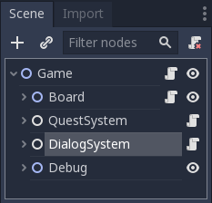

# Coding Guidelines

This document describes GDScript coding style and best practices to organize code base to keep sane when developing mid-to-large projects.

The ideas exposed below take inspiration from good practices from different paradigms and languages, especially from Python and functional programming, as well as the official GDScript documentation.

In order of importance:

1. [GDScript Style Guide](http://docs.godotengine.org/en/latest/getting_started/scripting/gdscript/gdscript_styleguide.html)
1. [Static typing in GDScript](http://docs.godotengine.org/en/latest/getting_started/scripting/gdscript/static_typing.html)
1. [Docs writing guidelines](http://docs.godotengine.org/en/latest/community/contributing/docs_writing_guidelines.html)
1. [Boundaries - A talk by Gary Bernhardt from SCNA 2012](https://www.destroyallsoftware.com/talks/boundaries) & [Functional Core, Imperative Shell](https://www.destroyallsoftware.com/screencasts/catalog/functional-core-imperative-shell)
1. [The Clean Architecture in Python](https://www.youtube.com/watch?v=DJtef410XaM)
1. [Onion Architecture Without the Tears - Brendan Richards](https://www.youtube.com/watch?v=R2pW09tMCnE&t=1095s)
1. [Domain Driven Design Through Onion Architecture](https://www.youtube.com/watch?v=pL9XeNjy_z4)

There isn’t a straightforward way of transposing these ideas into an object-oriented setting such as when working with Godot since it has its way of handling interactions.

To create modular and composable systems, we have to manage boundaries: the places where different game systems interact with one another. Especially the interaction of the game systems with the user.

## Code Writing Style

This section shows our programming style by example.

<!-- TODO: Add a short but complete, real-world example -->
Start with the `extends` keyword if the class extends a built-in type.

Then include `class_name`, but only if necessary. E.g. if you need to check for this type in other classes, or to be able to create the node in the create node dialogue.

Following that you should have the class's docstring:

```gdscript
extends Node
class_name MyNode

"""
A brief description of the class's role and functionality

A longer description, if needed, possibly of multiple paragraphs. Properties
and method names should be in backticks like so: `_process`, `x` etc.

Notes
-----
Specific things that don't fit the class's description above.

Keep lines under 100 characters long
"""
```

Signals go first and don't use parentheses unless they pass function parameters. Use the past tense to name signals. Append `_started` or `_finished` if the signal corresponds to the beginning or the end of an action.

```gdscript
signal moved
signal talk_started(parameter_name)
signal talk_finished
```

Place `onready` variables after signals, because we mostly use them to keep track of child nodes this class accesses. Having them at the top of the file makes it easier to keep track of dependencies.

You should always include an explicit type for them: in some cases, Godot can't infer the type directly, and it gives us limited autocompletion when we use these variables.

```gdscript
onready var timer : Timer = $Timer
onready var ysort : YSort = $YSort
```

After that enums, constants, and exported variables, in this order. The enums' names should be in `CamelCase` while the values themselves should be in `ALL_CAPS_SNAKE_CASE`. The reason for this order is that exported variables might depends on previously defined enums and constants.

```gdscript
enum TileTypes { EMPTY=-1, WALL, DOOR }

const MAX_TRIALS : = 3
const TARGET_POSITION : = Vector2(2, 56)

export(int) var number
```

Follow enums with member variables. Their names should use `snake_case`. Define setters and getters when properties alter their behavior instead of using methods to access them.

```gdscript
var animation_length : = 1.5
var tile_size : = 40
var side_length : = 5 setget set_side_length, get_side_length
```

Define virtual methods from Godot (those starting with a leading `_`, e.g. `_ready`). Always leave 2 blanks lines between methods to visually distinguish methods and other code blocks.

```gdscript
func _init() -> void:
  pass


func _process(delta: float) -> void:
  pass
```

Then define public methods. Include type hints for variables and the return type. We don't use private variables as anyone can decide to use them and they show in the autocomplete list. If you want to hide functionality away from the user, have the node delegate the work to one of its children.

You can use a brief docstring, if need be, to describe what the function does and what it returns. To describe the return value in the docstring, start the sentence with `Returns`. Use the present tense and direct voice. See Godot's [documentation writing guidelines](http://docs.godotengine.org/en/latest/community/contributing/docs_writing_guidelines.html) for more information.

```gdscript
func can_move(cell_coordinates: Vector2) -> bool:
  return grid[cell_coordinates] != TileTypes.WALL
```

For signal callbacks, we use Godot's convention,  `_on_NodeName_signal_name`:

```gdscript
func _on_Quest_started(which : Quest) -> void:
  ...
```

If the object connects to itself though, you should remove `NodeName`:

```gdscript
extends Area2D
class_name HitBox


func _ready() -> void:
  connect("area_entered", self, "_on_area_entered")
```

Use `return` only at the beginning and end of functions. If `return` is at the beginning, you can use it as a defense mechanism in an `if` statement.

**Don't** return in the middle of the method. It makes it harder to track returned values. Here's an example of a **clean** and readable method:

```gdscript
func _set_elements(elements: int) -> bool:
  """
  Sets up the shadow scale, number of visual elements and instantiates as needed.
  Returns true if the operation succeeds, else false
  """
  if not has_node("SkinViewport") or \
     elements > ELEMENTS_MAX or \
     not has_node("Shadow"):
    return false

  # If the check succeeds, proceed with the changes
  var skin_viewport : = $SkinViewport
  var skin_viewport_staticbody : = $SkinViewport/StaticBody2D
  for node in skin_viewport.get_children():
    if node != skin_viewport_staticbbody:
      node.queue_free()

  var interval : = INTERVAL
  var r : = RandomNumberGenerator.new()
  r.randomize()
  for i in range(elements):
    var e : = Element.new()
    e.node_a = "../StaticBody2D"
    e.position = skin_viewport_staticbody.position
    e.position.x += r.randf_range(interval.x, interval.y)
    interval = interval.rotated(PI/2)
    skin_viewport.add_child(e)

  $Shadow.scale = SHADOW.scale * (1.0 + elements/6.0)
  return true
```

### Avoid `null` like the plague

**Use `null` only if you're forced to**. Instead, think about alternatives to implement the same functionality with other types.

`None`, `null`, `NULL`, etc. references could be the biggest mistake in the history of computing. Here's an explanation from the man who invented it himself: [Null References: The Billion Dollar Mistake](https://www.infoq.com/presentations/Null-References-The-Billion-Dollar-Mistake-Tony-Hoare).

For programming languages that rely on `null`, such as GDScript, it's impossible to get rid of it completely: a lot of functionality relies on built-in functions that work with and return `null` values.

`null` can behave like any other value in any context, so the compiler can't find errors caused by `null` at compile time. `null` exceptions are only visible at runtime. This makes it more likely to write code that will fail when someone plays the game and it should be avoided like the plague.

You can use other values to initialize variables of certain types. For example, if a function returns a positive `int` number, if it is not able to calculate the desired return value, the function could return `-1` to suggest there was an error.

### Use static types

We use optional static typing with GDscript.

At the time of writing, static GDScript typing doesn't provide any perofrmance boosts or any other compiler features yet. But it does bring better code completion and better error reporting and warnings, which are good improvements over dynamically typed GDScript. In the future, it should bring performance improvements as well.

Be sure to check [Static typing in GDScript](http://docs.godotengine.org/en/latest/getting_started/scripting/gdscript/static_typing.html) to get started with this language feature.

Normally, you define typed variables like this:

```gdscript
var x : Vector2 = some_function_returning_Vector2(param1, param2)
```

But if `some_function_returning_Vector2` is also annotated with a return type, Godot can infer the type for us so we only need to add a colon after the variable's name:

```gdscript
func some_function_returning_Vector2(param1: int, param2: int) -> Vector2:
  # do some work
  return Vector2()

var v : = some_function_returning_Vector2(param1, param2) # The type is Vector2
```

_Note_ how we still use the collon in the assignment: `: =`. It isn't just `=`. Without the colon, the variable's type would be dynamic.

Use `: =` with a space between the colon and the equal sign, **not** `:=`. `: =` is easier to spot compared to `=`, in case someone forgets to use the colon.

**Let Godot infer the type whenever you can**. It's less error prone because the system keeps better track of types than we humanly can. It also pushes us to have proper return values for all the functions and methods that we write.

Since the static type system mostly brings better warnings and it isn't enforced, sometimes we have to help it out. The following snippet will make the problem clear:

```gdscript
var arr : = [1, 'test']
var s : String = arr.pop_back()
var i : int = arr.pop_back()
```

The `Array` type is a container for multiple diffrent types. In the example above, we have both an `int` and a `String` stored in the array. If you only wrote `var s : = arr.pop_back()`, Godot would complain because it doesn't know what type the `pop_back` method returns. You will get the same issue with all built-in methods that return the engine's `Variant` type. Open the code reference with <kbd>F4</kbd> and search for the methods to see that:

```
Variant pop_back()
  Remove the last element of the array.
```

`Variant` is a generic type that can hold any type Godot supports. That's why we have to explicitly write variable types when dealing with these functions: `var s : String = arr.pop_back()`.

In these cases, you must be careful as the following is also valid:

```gdscript
var arr : = [1, 'test']
var s : int = arr.pop_back()
var i : String = arr.pop_back()
```

You will not get any error with this code. At runtime, `s` will surprinsingly still contain a `String`, and `i` will contain an `int`. But a type check like `s is String` or `i is int` will return `false`. That's a weakness of the current type system that we should keep in mind.

### Write self-documenting code and use comments sparingly

If you need comments to explain most of what your code does, you can most likely rewrite it to make it more transparent for everyone. When working together or other an extended period, code readability is essential for everyone to stay productive.

Use clear variable names in plain English, and write full words. E.g. `character_position` and not `char_pos`. Same for method names.

**Do not** repeat the same word in the method's name and its arguments. E.g. write `Inventory.add(item)`, not `Inventory.add_item(item)`. The same goes for signals. Don't repeat the class's name in signals, use plain verbs instead:

```gdscript
Extends Node
class_name Event

signal started
signal completed
```

You *may* use short variable names inside of your methods, for local variables, to avoid repeating a type hint for instance. In the example below, the variable `e`, an instance of `Element`, only appears in 4 consecutive lines, so the code stays readable:

```gdscript
func _set_elements(elements: int) -> bool:
...
  for i in range(elements):
    var e : = Element.new()
    e.node_a = "../StaticBody2D"
    e.position = skin_viewport_staticbody.position
...
```

#### Use comments if they save time or add key explanations

Your code should be **self-explanatory whenever possible**. But sometimes it's not: you may have a long block of code that you can't change, or have some strange code to work around an engine bug. In these cases, writing a short comment above the corresponding block can save everyone a lot of time, including your future self.

In this example, the code involves transforming and multiplying matrices to calculate some position in Godot's 2d viewport. A one-line comment can capture what it does and avoid having to make sense of the calculations:

```gdscript
func drag_to(event_position: Vector2) -> void:
  # Calculate the position of the mouse cursor relative to the RectExtents' center
  var viewport_transform_inv := rect_extents.get_viewport().get_global_canvas_transform().affine_inverse()
  var viewport_position: Vector2 = viewport_transform_inv.xform(event_position)
  var transform_inv := rect_extents.get_global_transform().affine_inverse()
  var target_position : Vector2 = transform_inv.xform(viewport_position.round())
```

Here's a comment that explains why a seemingly strange line of code is necessary so another developer doesn't remove it inadvertently, thinking it's a mistake:

```gdscript
extends BattlerAI

func choose_action(actor : Battler, targets : Array = []):
    # We use yield even though the  an action is instantaneous
    # because the combat system expects this method to use a coroutine
    yield(get_tree(), "idle_frame")
    ...
```


## System Design and Interaction

Often the most difficult part of programming is designing and managing systems. This is especially true in the game development world where we want to push the hardware to the limit, make use of parallelism & concurency, async and pretty much every tool in the box.

*Dynamic Imperative Object Oriented* programming languages such as GDScript are very fast to prototype ideas in, but with this freedom there comes a price. It's very easy to create coupled systems that are hard to debug so we need some high-level guidelines to keep us from doing this. Decoupled systems are really nice because we can test them independently. The hallmark of these types of systems is that they don't care how the data is given to them, they can be viewed as black boxes that are given some data and produce some output (either visually or as return values). They don't know anything about the world outside of themselves and that's what makes them powerful.

So how can we create decoupled systems in Godot?

### The scene tree system

The tree data structure on which Godot builds the main functionality of the engine, through the node system is a recursive data structure. What this means is: if we pick any node in the scene tree, this node together with all its children nodes can be viewed at any point in time as a complete tree in itself, an independent scene.



In the example above, each node: `Board`, `QuestSystem` etc. can be viewed as a completely separate scene. This gives us the following idea: the implementation should such that, if we try to run the any of the nodes at any depth level as an independent scene we should be able to do it without any errors.

Take the `QuestSystem` for example. If we save it to a separate scene via `Save Branch as Scene`, we should be able to run this scene locally (`F6`) without any problems. It isn't expected to have the same exact behavior as when played as part of the main `Game` scene, because it could very well depend on other data, but it should still run without any errors:


*So the key takeaway here is that at each depth level in the scene tree, if we choose to save that tree branch as an independent scene, then we should be able to run it independently without any errors.*

In practice this means that we should never have direct references to specific objects from one system to another. Instead we should rely on a parent node to do the routing of information and on signals. In the above chase, the `Game` node has a script attached to it to route some information between systems, while the systems themselves (eg. `QuestSystem`, `DialogSystem`, etc.) have no idea of the existance of other outside systems.

### Godot signals

Signal in Godot are the [Observer pattern](http://gameprogrammingpatterns.com/observer.html), a very useful tool indeed. Since Godot, like any respectable game engine, comes with all sorts of systems: physics, rendering, input etc. that run in multiple threads in parallel to squeeze every bit of hardware resource available, there's often times when direct function calls aren't the right way to intract with objects.

But not just that. Say we have an animation that has random time speeds, so some times it finishes after 1 second, another time after 1.2 seconds etc. If we want to implement a behavior triggered when animation finishes it would be impossible if we didn't have a way to pass information around via signals.

*So rely on signals when orchestrating time-dependent interactions.*

In practice it's difficult to know exactly when to use functions and when to use signals, it can be a bit of trial & error loop, but with time and practice managing information passing will get easier.
