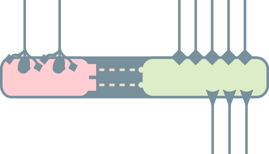
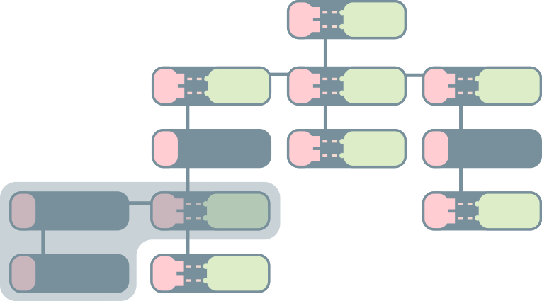

# Coding Guidelines

This document describes GDScript coding style and best practices to organize code base to keep sane when developing mid-to-large projects.

The ideas exposed below take inspiration from good practices from different paradigms and languages, especially from Python and functional programming, as well as the official GDScript documentation.

In order of importance:

1. [GDScript Style Guide](http://docs.godotengine.org/en/latest/getting_started/scripting/gdscript/gdscript_styleguide.html)
1. [Static typing in GDScript](http://docs.godotengine.org/en/latest/getting_started/scripting/gdscript/static_typing.html)
1. [Docs writing guidelines](http://docs.godotengine.org/en/latest/community/contributing/docs_writing_guidelines.html)
1. [Boundaries - A talk by Gary Bernhardt from SCNA 2012](https://www.destroyallsoftware.com/talks/boundaries) & [Functional Core, Imperative Shell](https://www.destroyallsoftware.com/screencasts/catalog/functional-core-imperative-shell)
1. [The Clean Architecture in Python](https://www.youtube.com/watch?v=DJtef410XaM)
1. [Onion Architecture Without the Tears - Brendan Richards](https://www.youtube.com/watch?v=R2pW09tMCnE&t=1095s)
1. [Domain Driven Design Through Onion Architecture](https://www.youtube.com/watch?v=pL9XeNjy_z4)

There isn’t a straightforward way of transposing these ideas into an object-oriented setting such as when working with Godot since it has its way of handling interactions.

To create modular and composable systems, we have to manage boundaries: the places where different game systems interact with one another. Especially the interaction of the game systems with the user.

## Code Writing Style

This section shows our programming style by example.

<!-- TODO: Add a short but complete, real-world example -->
Start with the `extends` keyword if the class extends a built-in type.

Then include `class_name`, but only if necessary. E.g. if you need to check for this type in other classes, or to be able to create the node in the create node dialogue.

Following that you should have the class's docstring:

```gdscript
extends Node
class_name MyNode

"""
A brief description of the class's role and functionality

A longer description, if needed, possibly of multiple paragraphs. Properties
and method names should be in backticks like so: `_process`, `x` etc.

Notes
-----
Specific things that don't fit the class's description above.

Keep lines under 100 characters long
"""
```

Signals go first and don't use parentheses unless they pass function parameters. Use the past tense to name signals. Append `_started` or `_finished` if the signal corresponds to the beginning or the end of an action.

```gdscript
signal moved
signal talk_started(parameter_name)
signal talk_finished
```

Place `onready` variables after signals, because we mostly use them to keep track of child nodes this class accesses. Having them at the top of the file makes it easier to keep track of dependencies.

You should always include an explicit type for them: in some cases, Godot can't infer the type directly, and it gives us limited autocompletion when we use onready variables.

```gdscript
onready var timer : Timer = $HungerCheckTimer
onready var ysort : YSort = $YSort
```

After that constants, enums, exported, public (regular name), and pseudo-private (starting with `_`) variables, in this order. Enum type names should be in `CamelCase` while the enum values themselves should be in `ALL_CAPS_SNAKE_CASE`. The reason for this order is that exported variables might depends on previously defined enums and constants while the enums might also depend on constants.

```gdscript
const MAX_TRIALS : = 3
const TARGET_POSITION : = Vector2(2, 56)

enum TileTypes { EMPTY=-1, WALL, DOOR }

export(int) var number
```

Following enums are public and pseudo-private member variables. Their names should use `snake_case`, `_snake_case_with_leading_underscore` respectively.

Define setters and getters when properties alter node/class state or if it trigggeres behaviors (methods). When doing this care needs to be taken because we can easily loose track of this hidden alterations and behaviors. Include a docstring if the setters/getters modify the node/class state in complex ways.

When writing setters/getters for pseudo-private variables start with a leading underscore, just like in the case of the variable.

```gdscript
var animation_length : = 1.5
var tile_size : = 40
var side_length : = 5 setget set_side_length, get_side_length

var _count : = 0 setget _set_count, _get_count
var _state : = Idle.new()
```

Next define virtual methods from Godot (those starting with a leading `_`, e.g. `_ready`). Always leave 2 blanks lines between methods to visually distinguish them and other code blocks.

```gdscript
func _init() -> void:
  pass


func _process(delta: float) -> void:
  pass
```

Then define public methods. Include type hints for variables and the return type.

You can use a brief docstring, if need be, to describe what the function does and what it returns. To describe the return value in the docstring, start the sentence with `Returns`. Use the present tense and direct voice. See Godot's [documentation writing guidelines](http://docs.godotengine.org/en/latest/community/contributing/docs_writing_guidelines.html) for more information.

```gdscript
func can_move(cell_coordinates: Vector2) -> bool:
  return grid[cell_coordinates] != TileTypes.WALL
```

For signal callbacks, we use Godot's convention,  `_on_NodeName_signal_name`:

```gdscript
func _on_Quest_started(which : Quest) -> void:
  ...
```

If the object connects to itself though, you should remove `NodeName`:

```gdscript
extends Area2D
class_name HitBox


func _ready() -> void:
  connect("area_entered", self, "_on_area_entered")
```

Use `return` only at the beginning and end of functions. At the beginning of the function we use `return` as a guard mechanism if the conditions for executing the function aren't met.

**Don't** return in the middle of the method. It makes it harder to track returned values. Here's an example of a **clean** and readable method:

```gdscript
func _set_elements(elements: int) -> bool:
  """
  Sets up the shadow scale, number of visual elements and instantiates as needed.
  Returns true if the operation succeeds, else false
  """
  if (not has_node("SkinViewport") or
      elements > ELEMENTS_MAX or
      not has_node("Shadow")):
    return false

  # If the check succeeds, proceed with the changes
  var skin_viewport : = $SkinViewport
  var skin_viewport_staticbody : = $SkinViewport/StaticBody2D
  for node in skin_viewport.get_children():
    if node != skin_viewport_staticbbody:
      node.queue_free()

  var interval : = INTERVAL
  var r : = RandomNumberGenerator.new()
  r.randomize()
  for i in range(elements):
    var e : = Element.new()
    e.node_a = "../StaticBody2D"
    e.position = skin_viewport_staticbody.position
    e.position.x += r.randf_range(interval.x, interval.y)
    interval = interval.rotated(PI/2)
    skin_viewport.add_child(e)

  $Shadow.scale = SHADOW.scale * (1.0 + elements/6.0)
  return true
```

### Avoid `null` like the plague

**Use `null` only if you're forced to**. Instead, think about alternatives to implement the same functionality with other types.

`None`, `null`, `NULL`, etc. references could be the biggest mistake in the history of computing. Here's an explanation from the man who invented it himself: [Null References: The Billion Dollar Mistake](https://www.infoq.com/presentations/Null-References-The-Billion-Dollar-Mistake-Tony-Hoare).

For programming languages that rely on `null`, such as GDScript, it's impossible to get rid of it completely: a lot of functionality relies on built-in functions that work with and return `null` values.

`null` can behave like any other value in any context, so the compiler can't find errors caused by `null` at compile time. `null` exceptions are only visible at runtime. This makes it more likely to write code that will fail when someone plays the game and it should be avoided like the plague.

You can use other values to initialize variables of certain types. For example, if a function returns a positive `int` number, if it is not able to calculate the desired return value, the function could return `-1` to suggest there was an error.

### Use static types

We use optional static typing with GDscript.

At the time of writing, static GDScript typing doesn't provide any performance boosts or any other compiler features yet. But it does bring better code completion and better error reporting and warnings, which are good improvements over dynamically typed GDScript. In the future, it should bring performance improvements as well.

Be sure to check [Static typing in GDScript](http://docs.godotengine.org/en/latest/getting_started/scripting/gdscript/static_typing.html) to get started with this language feature.

Normally, you define typed variables like this:

```gdscript
var x : Vector2 = some_function_returning_Vector2(param1, param2)
```

But if `some_function_returning_Vector2` is also annotated with a return type, Godot can infer the type for us so we only need to add a colon after the variable's name:

```gdscript
func some_function_returning_Vector2(param1: int, param2: int) -> Vector2:
  # do some work
  return Vector2()

var v : = some_function_returning_Vector2(param1, param2) # The type is Vector2
```

_Note_ how we still use the collon in the assignment: `: =`. It isn't just `=`. Without the colon, the variable's type would be dynamic.

Use `: =` with a space between the colon and the equal sign, **not** `:=`. `: =` is easier to spot compared to `=`, in case someone forgets to use the colon.

**Let Godot infer the type whenever you can**. It's less error prone because the system keeps better track of types than we humanly can. It also pushes us to have proper return values for all the functions and methods that we write.

Since the static type system mostly brings better warnings and it isn't enforced, sometimes we have to help it out. The following snippet will make the problem clear:

```gdscript
var arr : = [1, 'test']
var s : String = arr.pop_back()
var i : int = arr.pop_back()
```

The `Array` type is a container for multiple diffrent types. In the example above, we have both an `int` and a `String` stored in the array. If you only wrote `var s : = arr.pop_back()`, Godot would complain because it doesn't know what type the `pop_back` method returns. You will get the same issue with all built-in methods that return the engine's `Variant` type. Open the code reference with <kbd>F4</kbd> and search for the methods to see that:

```
Variant pop_back()
  Remove the last element of the array.
```

`Variant` is a generic type that can hold any type Godot supports. That's why we have to explicitly write variable types when dealing with these functions: `var s : String = arr.pop_back()`.

In these cases, you must be careful as the following is also valid:

```gdscript
var arr : = [1, 'test']
var s : int = arr.pop_back()
var i : String = arr.pop_back()
```

You will not get any error with this code. At runtime, `s` will surprinsingly still contain a `String`, and `i` will contain an `int`. But a type check like `s is String` or `i is int` will return `false`. That's a weakness of the current type system that we should keep in mind.

### Write self-documenting code and use comments sparingly

If you need comments to explain most of what your code does, you can most likely rewrite it to make it more transparent for everyone. When working together or other an extended period, code readability is essential for everyone to stay productive.

Use clear variable names in plain English, and write full words. E.g. `character_position` and not `char_pos`. Same for method names.

**Do not** repeat the same word in the method's name and its arguments. E.g. write `Inventory.add(item)`, not `Inventory.add_item(item)`. The same goes for signals. Don't repeat the class's name in signals, use plain verbs instead:

```gdscript
Extends Node
class_name Event

signal started
signal completed
```

You _may_ use short variable names inside of your methods, for local variables, to avoid repeating a type hint for instance. In the example below, the variable `e`, an instance of `Element`, only appears in 4 consecutive lines, so the code stays readable:

```gdscript
func _set_elements(elements: int) -> bool:
...
  for i in range(elements):
    var e : = Element.new()
    e.node_a = "../StaticBody2D"
    e.position = skin_viewport_staticbody.position
...
```

#### Use comments if they save time or add key explanations

Your code should be **self-explanatory whenever possible**. But sometimes it's not: you may have a long block of code that you can't change, or have some strange code to work around an engine bug. In these cases, writing a short comment above the corresponding block can save everyone a lot of time, including your future self.

In this example, the code involves transforming and multiplying matrices to calculate some position in Godot's 2d viewport. A one-line comment can capture what it does and avoid having to make sense of the calculations:

```gdscript
func drag_to(event_position: Vector2) -> void:
  # Calculate the position of the mouse cursor relative to the RectExtents' center
  var viewport_transform_inverse := rect_extents.get_viewport().get_global_canvas_transform().affine_inverse()
  var viewport_position: Vector2 = viewport_transform_inv.xform(event_position)
  var transform_inverse := rect_extents.get_global_transform().affine_inverse()
  var target_position : Vector2 = transform_inv.xform(viewport_position.round())
```

Here's a comment that explains why a seemingly strange line of code is necessary so another developer doesn't remove it inadvertently, thinking it's a mistake:

```gdscript
extends BattlerAI

func choose_action(actor : Battler, targets : Array = []):
    # We use yield even though the  an action is instantaneous
    # because the combat system expects this method to use a coroutine
    yield(get_tree(), "idle_frame")
    ...
```


## System Design and Interactions

In this section we're going to discuss how can we create decoupled and reusable game systems in Godot.

One of the most difficult jobs of a developer is to design and to manage different systems interacting with one another. This is especially true in the game development world where we push the hardware to the limit, making use of parallelism & concurency, async, and every tool in the box.

_Dynamic Imperative Object-Oriented_ programming languages like GDScript are fast to prototype ideas with, but with this freedom there comes a cost. It's easy to create tightly coupled code or fragile code, code that will break. That is to say systems that are hard to debug.

We need some high-level guidelines to avoid producing coupled code. We can test decoupled systems independently. Decoupled systems don't care where they receive data from. They are black-boxes that are fed data and produce some output, be it visual or returned values. They don't know anything about the world outside of themselves. This makes them independent and reusable across game projects.

### Every node and scene should run on its own

**If we choose to save a branch as a scene, we should be able to run it on its own without any errors**. This is the golden rule to follow. This behavior should be attainable at each level in the scene tree.

Godot's main functionality relies on its node tree, a recursive data structure: if we pick any node in the tree, this node, together with all of its children, is a complete tree in itself. You can see and think about it as an independent scene.

<a name="fig1"></a>


Fig. 1: _Screenshot of a real system scene tree layout from [OpenRPG]_

In the example above, you can view each node as a separate scene, be it `Board` or `QuestSystem`.

If we save `QuestSystem` using `Save Branch as Scene`, we should be able to run this scene locally, with <kbd>F6</kbd>, without any error. In this case we can't expect to have the same behavior as when we play the main `Game` scene, as it could depend on other data to show all its potential, but it should still run without any errors.

<a name="fig2"></a>


Fig. 2: _Example of how systems should work independently, even if they aren't a part of the main scene._

In general, if we try to run any of the nodes at any depth level as an independent scene we should be able to do it without any errors.

To do so you should never have direct references to specific objects from another system. Instead, you should rely on a parent node to route information and let the systems interconnect via signals.

In the example above, the `Game` node has a script attached to it. This script sends some information from one system to another, while e.g. `QuestSystem` or `DialogSystem` have no knowledge about any other system other than themselves.

<!-- TODO: cover a real-world example, e.g. in video? -->

### Use signals to coordinate time-dependent interactions

Godot's signals are the [Observer pattern](http://gameprogrammingpatterns.com/observer.html), a very useful tool that allows one node to react to a change in another, without storing it or having a direct reference to it.

Godot comes with many systems like physics, rendering, or input that run in parallel threads to squeeze every bit of hardware resource available. Oftentimes direct function calls aren't the right way to interact with objects.

Also, we can't always predict when an event will occur. Say we have an animation with a random or a varying duration. Sometimes it ends after 1 second, sometimes after 1.2 seconds. Signals allow us to react to the animation right when it finishes, regardless of its duration.

In practice, it can be difficult to know exactly when to use direct function calls and when to use signals. But with time and practice, managing information gets easier.

So **rely on signals when orchestrating time-dependent interactions.**


### Reinforcing good habbit

Through GDScript, Godot prefers a coding style that is loose and free of any burden. This can quickly lead to spaghetti code since there's no mechanism by which Godot enforces nodes/scenes to be isolated. So it's up to us to keep track and implement this isolation.

<a name="fig3"></a>


Fig. 3: _A Node/Scene is composed of state (![state]) and behaior (![behavior])_

In [Fig. 3] above, there's a depiction of a typical node/scene in Godot. It bundles up both state (![state]) and behavior (![behavior]) that can access this state at any time and alter it (![inner_connection]). But even more so, the lines coming in from the outside depict here other types of interactions that could happen from the external world (other systems):

- access to state directly, potentially changing it (![state_connection])
- access to behavior, i.e. methods (![behavior_connection])
- connections to methods via signals (![signal_connection])

It's very easy to imagine how even a simple scene tree like the one in [Fig. 4] can quickly become unmaintainable if all this flexibility isn't managed. Just think of what would mean to draw in all those potential connections from the exterior, as depicted in [Fig. 3].

<a name="fig4"></a>


Fig. 4: _A relatively simple depiction of a Godot scene tree. The highlighted part represents a completely independent scene_

The following are some good tips to keep in mind and try to follow whenever possible.

We alredy went through this, but just to reinforce it even more - scenes should be independent and at any moment in our game development, if we choose to save a part of the node tree as a scene, **it should run by itself without any errors** (<kbd>F6</kbd>)

<!-- TODO: show a concrete example -->
Minimize changing the state of child nodes/scenes from parent nodes, unless the scene we're working with is logically built that way. For example, in [Fig. 4], in the highlighted node tree we see that the children nodes hold just data, but no custom behaviors that alters their state. The parent node in this case can access and potentially change the state of its children. In this case, the entire scene can be viewed from the outside like a black-box. All changes go through the parent node, with no direct access to the child nodes.

The idea of the black-box node/scene is more general. We should always strive to enforce it whenever possible. It's more strict than the simple idea of having independent scenes that can always run on their own. Scenes that are decoupled in this way, can still have their inner state be accessed by parent nodes and changed at run-time.

With the black-box, we extend this rule and strive not to change the state of child nodes/scenes from parent nodes or other systems except through signals.

The black-box scene is solely responsible for it's own behavior.

As an additional rule, the other way is true as well: _never_ change state of parent nodes from child nodes, unless through signals.

_Note_ that these are still just guidelines, they're not rules. Certain systems have to be built in other ways that can't uphold these ideas. The `AnimationPlayer` node is a good example. We can set the `root_node` property of the `AnimationPlayer` to point to any node in our node hierarchy and by default it operates relative to its parent. That's because it's awkward, impractical and hard to reason about to have a scene hierarchy where the `AnimationPlayer` node is the parent node.

Here are a few ideas that could improve code maintainability and overall structure:

1. Break up complex functions into smaller functions (ideally up to 10-15 lines of code and no more) and give them descriptive names

<a name="fig5"></a>


Fig. 5: _[OpenRPG](https://github.com/razcore-art/godot-open-rpg) experimental branch scene tree. Note how `Board` with its `PathFinder` algorithm is at the same level as `Party`. They're independent systems in this implementation. The `Party` node/scene can be viewed as the player object._

```gdscript
# Game.gd file

# [...]

func _unhandled_input(event: InputEvent) -> void:
  var move_direction : = Utils.get_direction(event)
  if event.is_action_pressed("tap"):
    party_command({tap_position = board.get_global_mouse_position()})
  elif not dialog_system.is_open and move_direction != Vector2():
    party_command({move_direction = move_direction})


func party_command(msg: Dictionary = {}) -> void:
  var leader : = party.get_member(0)
  if leader == null:
    return

  var path : = prepare_path(leader, msg)
  party_walk(leader, path)

  var destination : = get_party_destination(path)
  if destination != Vector2():
    emit_signal("party_walk_started", {"to": destination})


func prepare_path(leader: Actor, msg: Dictionary = {}) -> Array:
  var path : = []
  match msg:
    {"tap_position": var tap_position}:
      path = board.get_point_path(leader.position, tap_position)
    {"move_direction": var move_direction}:
      if move_direction in board.path_finder.possible_directions:
        var from : Vector2 = leader.position
        var to : = from + Utils.to_px(move_direction, board.path_finder.map.cell_size)
        if not board.path_finder.map.world_to_map(to) in board.path_finder.map.obstacles:
          path.push_back(from)
          path.push_back(to)
  return path


func party_walk(leader: Actor, path: Array) -> void:
  if leader.is_walking:
    return

  for member in party.get_members():
    if member != leader:
      path = [member.position] + path
      path.pop_back()
    member.walk(path)


func get_party_destination(path: Array) -> Vector2:
  var destination : Vector2 = path[path.size() - 1] if not path.empty() else Vector2()
  return destination
```

In the example above, reading through `party_command` without looking at the implementation of other functions we already have a pretty good idea about what it does. That's because we divided up the implementation into smaller functions and giving expressive names to these functions.

_Note_ how we are careful here to not alter any state of other nodes. We only access the state in order to perform validations. This is important! All state changes that happen, happen within the respective **black-boxes**.

The implementation for checking if the walk command can be issued is within a parent node, in this case the `Game.gd` script. That's because the verification depends on the `PathFinder` algorithm which is part of the separate `Board` system, while the player object (the `Party` here) is independent, it's a sibling relationship. The validation step depends on both `Party` and the `Board` and that's why it's taken care of the level of the top `Game` node [Fig. 5]. Otherwise we'd have to introduce an interdependence between `Party` & `Board` and that would tightly couple these systems.

Which leades us to:

2. Don't store references to systems within other systems.

For example, in the above, we could have had `Party` set up in such a way as to store a reference to `Board` and do all the validation checks on `path` inside of `Party`, but this would mean that it is tightly coupled with `Board`. Whenever possible we should avoid this.

3. Never alter state from a function that returns a concrete type (i.e. functions that don't return `-> void`).

Again, referring to the code above, we can see that `prepare_path` and `get_party_destination` each return a concrete type: `-> Array`, respectively`-> Vector2`. They have no other purpose than to calculate the promised return type and nothing more. They don't have any hidden agenda, don't alter anything, don't give commands to other functions that change state. They have a very precise "pure" job to do.

We could have for example called `party_walk` from within `get_party_destination` and rewrite the code a bit to make that work, but we would essentially hide a behavior that doesn't have anything to do with returning or calculating a `Vector2`. This means that if we wouldn't follow along the implementation we wouldn't know what's happening. This entanglement of concerns is a potential error generator.

Now, like before, this isn't a hard rule even though we say _never_. For example, there's a lot of times when we want to return a check, a `bool` value from within a function upon the successful execution of a behavior. The above `party_walk` function could be rewritten like this:

```gdscript
func party_command(msg: Dictionary = {}) -> void:
  var leader : = party.get_member(0)
  if leader == null:
    return

  var path : = prepare_path(leader, msg)
  if party_walk(leader, path):
    var destination : = get_party_destination(path)
    emit_signal("party_walk_started", {"to": destination})


# [...]


func party_walk(leader: Actor, path: Array) -> bool:
  if leader.is_walking:
    return false

  for member in party.get_members():
    if member != leader:
      path = [member.position] + path
      path.pop_back()
    member.walk(path)
  return true
```

Typically, returning `bool` values like this in order to validate a successful execution is a decent idea. _So keep in mind once more, these are just guidelines!_

4. The following is potentially an interesting concept, but it isn't as important as the ones above: unify the signals signature. What this means is to declare signals like this: `signal walked(msg)` where `msg: Dictionary`.

At the moment, there isn't a way to enforce the type on signal parameters even with static typed GDScript, i.e. the following isn't valid: `signal walked(msg: Dictionary)`. But we could generally impose on ourselves to use signals only with a `Dictionary` type.

This has some advantages and disadvantages. The primary disadvantage is that static typed GDScript won't be as helpful since `Dictinoary` is a bag of mixed data types essentially.

On the other hand, the advantage is that we can have one single entry for all signals within a node. In some top level node we might have:

```gdscript
func connect_signals() -> void:
  dialog_system.connect("next_pressed", party, "_on_signal")
  quest_system.connect("quest_finished", party, "_on_signal")
  quest_system.connect("quest_canceled", party, "_on_signal")
  board.connect("encountered", party, "_on_signal")
```

While `Party` would implement the connected function:

```gdscript
func _on_signal(msg: Dictionary) -> void:
  match msg:
    {"dialog_visible": var dialog_visible}:
      # call appropriate function when dialog changes visibility
    {"quest_successful": true, "quest": var quest, "reward": var reward}:
      # call functio to use reward of given quest when quest successful
      # maybe play some happy animation on Party members
    {"quest_canceled_reason": var quest_canceled_reason}:
      # do something when quest was canceled
    {"encounter": var encounter}:
      # do something like play a wave animation when a specific encounter is given
    _:
      # default reaction when none of the above happens
```

Using the `match` keyword this way we mitigate some of the negative effects of not being able to use the static type system, even though there's still some risk involved since Godot can't know the types of the variables stored inside the `Dictionary`: `dialog_visible`, `quest`, etc. So they could potentially be `null` or an incorrect type if we're not careful.

On the other hand, doing this limits the entry points for triggering behavior that changes the internal state and this is the main benefit.


[OpenRPG]: https://github.com/GDquest/godot-open-rpg
[state]: ./imgs/node_state.png
[behavior]: ./imgs/node_behavior.png
[inner_connection]: ./imgs/node_inner_connection.png
[state_connection]: ./imgs/node_state_connection.png
[behavior_connection]: ./imgs/node_behavior_connection.png
[signal_connection]: ./imgs/node_signal_connection.png
[Fig. 1]: #fig1
[Fig. 2]: #fig2
[Fig. 3]: #fig3
[Fig. 4]: #fig4
[Fig. 5]: #fig5
